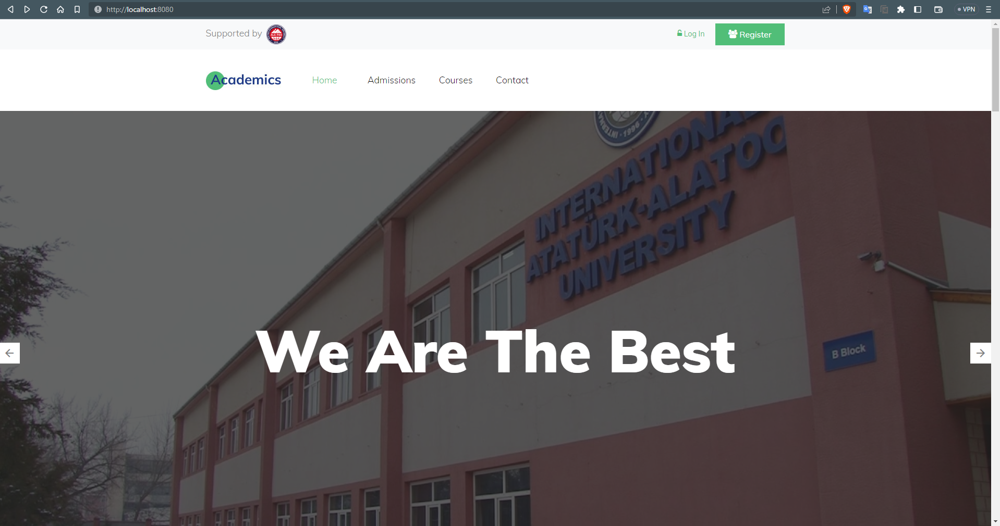
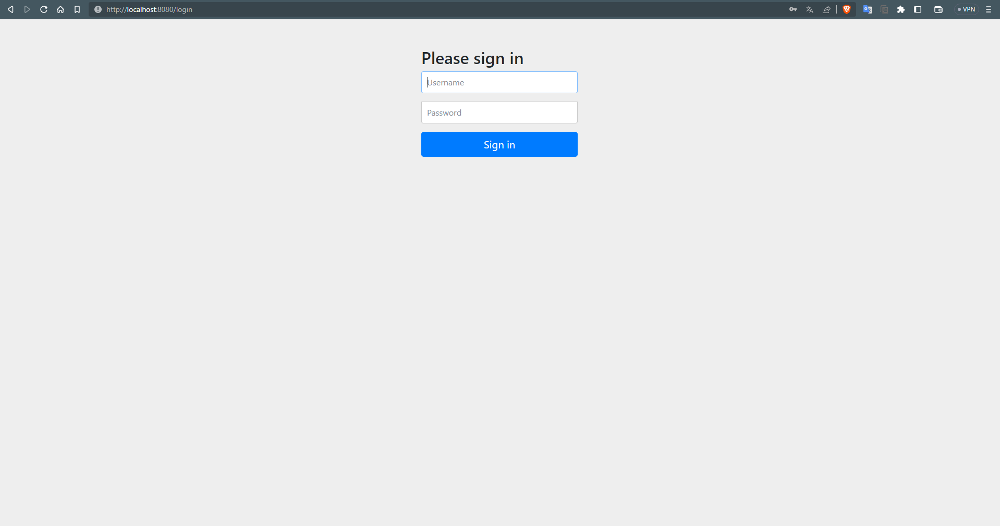
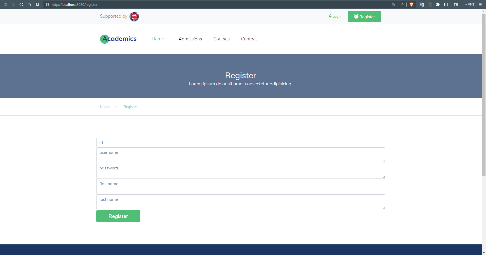
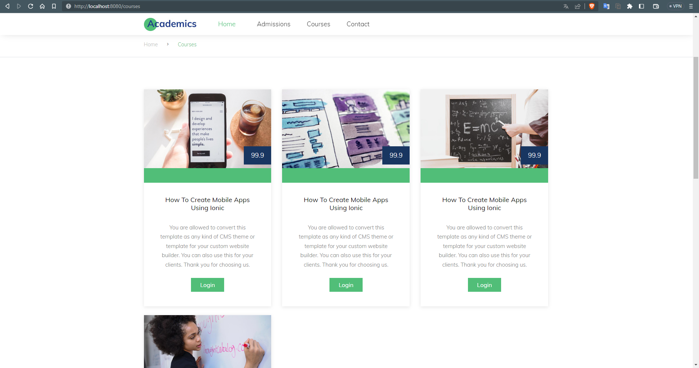
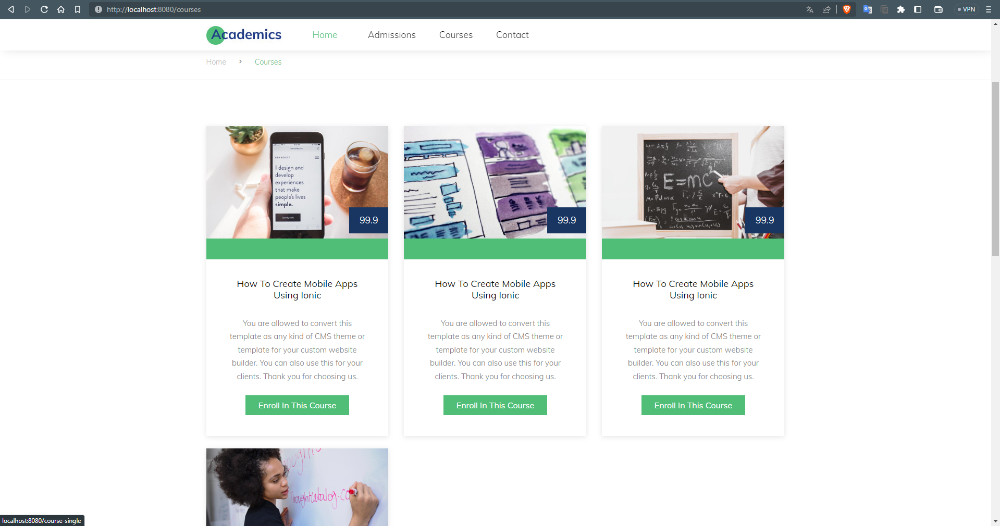
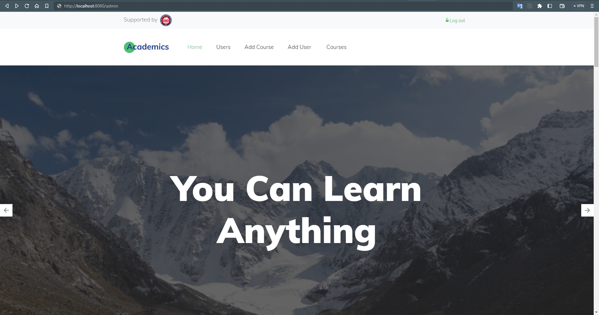
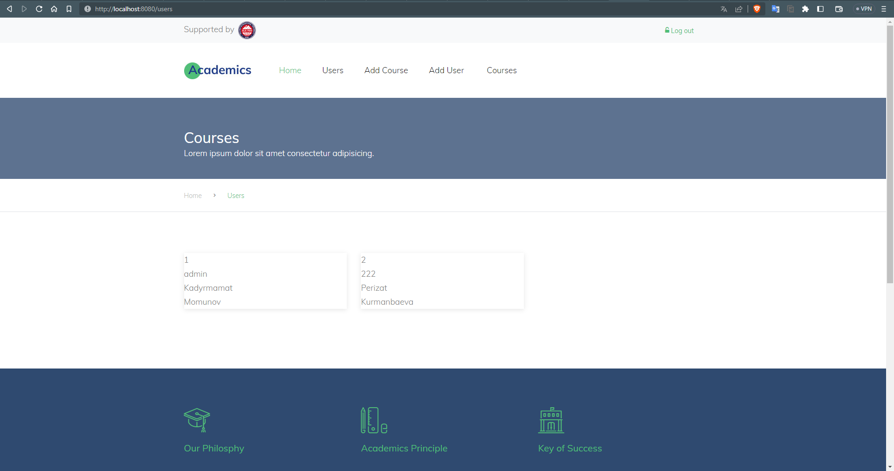
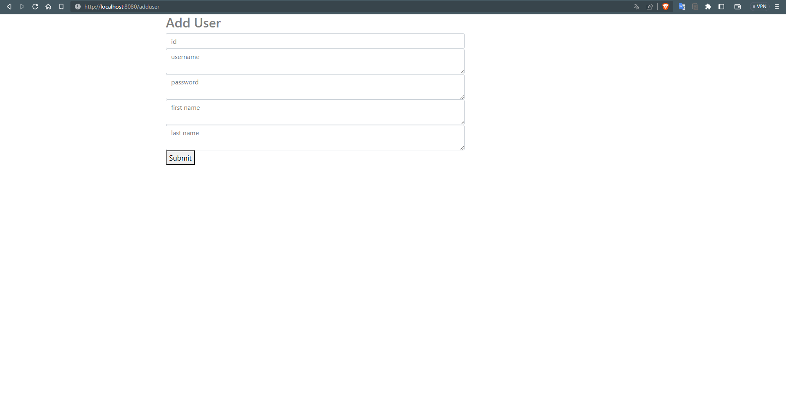
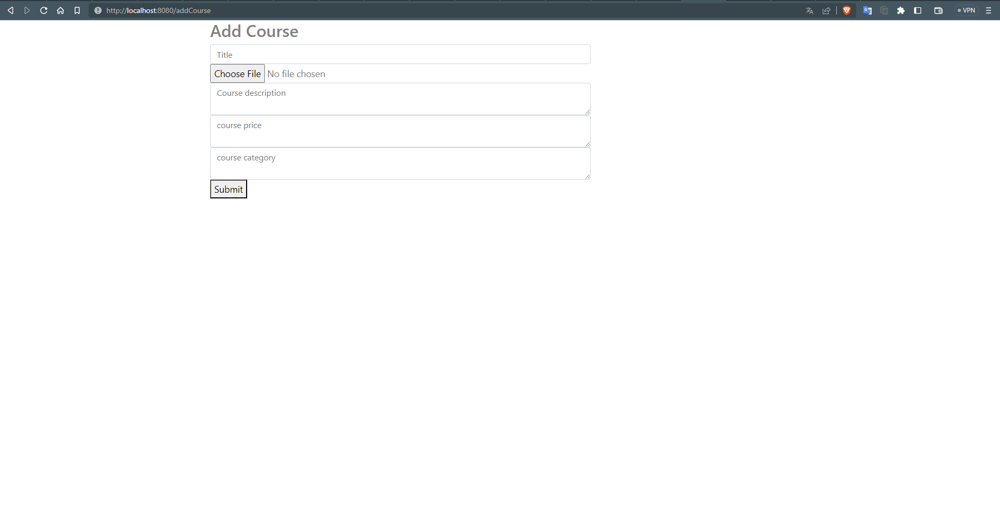
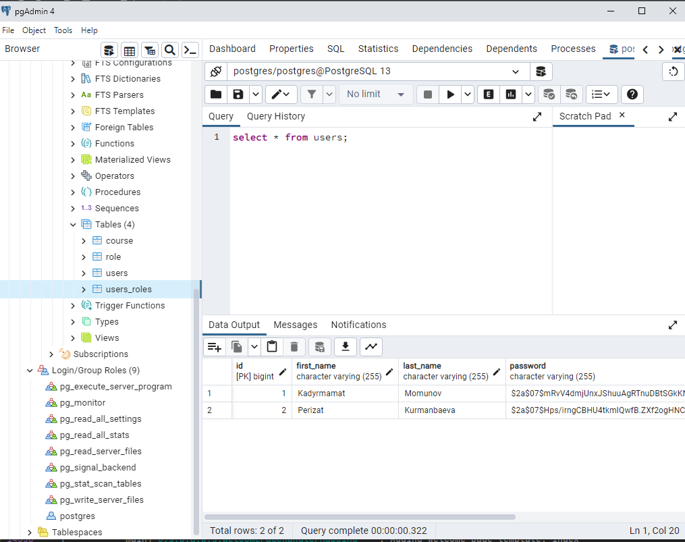

# Academics
Academics is an educational platform where users can choose courses. The project also includes an admin panel where admins can add, delete, and update users and courses.

## Features
- User registration and login
- Browse courses by category
- Add courses to cart and checkout
- Admin panel with the following features:
  - User management (add, delete, update)
  - Course management (add, delete, update)

## Technologies Used
- Front-end: HTML, CSS, JavaScript
- Back-end: Java SpringBoot
- Database: PostgreSQL

## Installation
To install the project, follow these steps:
- Clone the repository
- Install dependencies
- Start the file AcademicsApplication.java

## Usage
Once the server is running, you can access the Academics platform by navigating to http://localhost:8080 in your web browser. From there, you can browse available courses after registration, and checkout. Admins can access the admin panel by navigating to http://localhost:8080/admin and sign in as admin(username: admin, password: admin).

## Contributing
If you'd like to contribute to the project, please follow these steps:
- Fork the repository
- Create a new branch for your changes
- Make your changes and commit them
- Push your changes to your forked repository
- Submit a pull request

## Tutorial
- [Youtube](youtube.com)

## Screenshots
- ### Main page
  - 

- ### Login page
  - 

- ### Registration page
  - 

- ### Courses page for anonymous
  - 

- ### Courses page for authorized users
  - 

- ### Admin page
  - 

- ### Course page for users with role admin
  - 

- ### Users
  - 

- ### Adding User
  - 

- ### Adding Course
  - 

- ### DB
  - 

